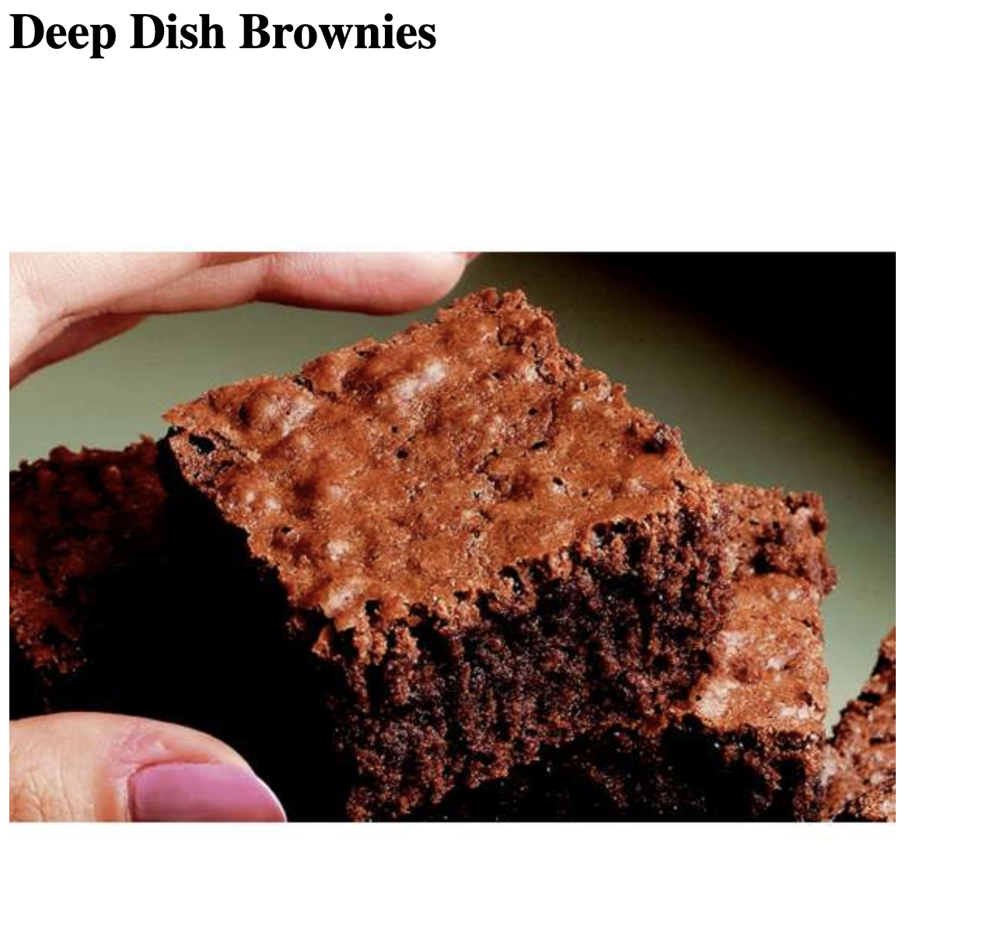

# brownieRecipe

A brownie recipe marked up in HTML!

## Link to Project:

zikrebrownierecipe.netlify.com

## How It's Made:

## Tech Used:     

HTML

An early piece of code I wrote based on a brownie recipe

## Lessons Learned:

It was interesting learning how to use headings properly !

## Examples of other work:

https://github.com/zikrehaimanot/todo-list-2019-week05/tree/answer

https://github.com/zikrehaimanot/calculator

https://github.com/zikrehaimanot/rpsGame

https://github.com/zikrehaimanot/foodist

https://github.com/zikrehaimanot/fizzbuzz

https://github.com/zikrehaimanot/slot-machine-2019-week05/tree/answer
